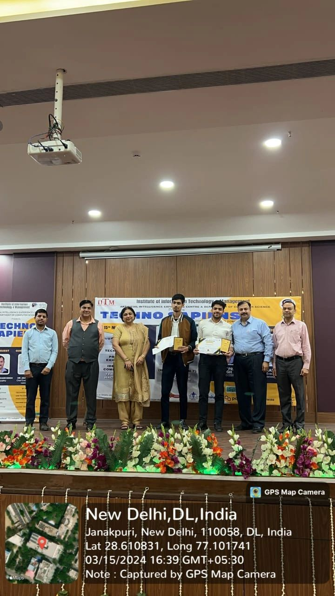

<h1> My All Adruino Projects</h1>

<h2> ATAL LAB ❤ ADRUINO</h2>
 

<b> Link: https://www.youtube.com/watch?v=-G-9CUIwk28&list=PLV3C-t_tgjGFyXP_-AF37AoIuxM9jzELM&index=16 🤳 learn from youtube!</b>

  

<b> Github Live-Link: https://blocknotes-4515.github.io/Adruino-/</b>

# Adruino-
Adruino Projects from (Basics-Advanced) Pro.

<!--

-->

<h1><b><u>RC Obstacle Detection System + Voice Recognizatons Modules!</b></h1>
<h2>Steps for begineers</h2>

<i>

  <ul>
 <li>1. Install Adruino IDE.</li> 
  <li>2. Connect <u>(Laptop->Adruino)</u> By DTC-(Data- Transfer - Cable).</li>
  <li>3. Open the Adruino IDE.</li>
  <li>4. Select Bard (Tools->Board) My Board is : UNO 🛸</li>
  <li>5. Select Ports (Tools-> Port).</li>
  <li>6. Open and Create Skectch (the Write the Code) in IDE.</li>
  <li>7. Verify & Compile (Ctrl+R) and then Skecth (verify/Compile).</li>
  <li>8. Upload then (Ctrl+U) (Sketch->Upload).</li>
  <li>9. Monitor Serial Output (Optional).</li>
  </ul>

</i>

<h3>

  NOTE: IF ANY ERROR (REMEMBER)!<ul>
  <li>--> (i). Check the Connections.</li>
  <li>--> (ii). Board Selections like: UNO.</li>      
   <li>--> (iii). Port Settings.</li>     

</h3>

  
  
    

  

    
  <h1>OBSTACLE AVOIDING ROBOT</h1>

<b>Introduction:</b>  An obstacle avoiding robot is an autonomous robot which is able to 
avoid any obstacle it face when it moves. Simply, when it met an obstacle while it 
moving forward, automatically stop moving forward and makes a step back then it 
takes a little turn and moves forward with the same loop. This obstacle avoiding 
robot we are demonstrating here is very helpful and this is a simple demonstration 
of obstacle avoiding process for sophisticated technologies and machines. It is the 
base of many large projects such as Automatic cars, robots used in Manufacturing 
factories, even in robots used in spacecraft’s or interplanetary robotic missions like 
Mars rover

<b>Components used:</b> In this robotic project we are using following components:
  <ul>
<li> Arduino UNO</li>
<li> 2 Wheel Drive robotic chassis</li>
<li> Two DC BO motors</li>
<li> L293 motor driver</li>
<li> HC-SR04 Ultrasonic sensor</li>
<li> Switch</li>
<li> 9v Batteries and connector</li>
<li> Jumper wires</li>
<li> Caster</li>
<li> Nut-Bolts, Spacer</li>
<li> Other supporting components and tools </li>

  <b>Basic principle:</b> The robot uses Ultrasonic sensor to detect the obstacle and motor 
driver is used to drive the motor according to the ultrasonic signal as per code 
written in the Arduino.
    
<b>Ultrasonic sensor:</b> The ultrasonic sensor has a signal generator and a receiver. The 
signal generator generates an ultrasonic wave and transmits in the forward 
direction. The transmitted wave strikes any obstacle in its path and a huge part of it 
gets reflected. The receiver receives the reflected wave.The obtained values from the ultrasonic sensor need to be calibrated in order to get 
a meaningful data (distance). The distance of the object is calculated on the basis of 
the time taken by the wave in the process of transmission, reflection and collection.

  <b>Arduino:</b> Arduino is an open-source electronics platform based on easy-to-use 
hardware and software. Arduino boards are able to read inputs (Like-light on a 
sensor, a signal of a button, or a signal from sensor etc) and turn it into an output 
(Like- activating a motor, turning on an LED, publishing something online etc). We 
can tell our board what to do by sending a set of instructions to the microcontroller 
on the board. To do so we use the Arduino programming language and the Arduino 
Software (IDE).
In this project, to avoid the obstacle in the path, a condition is put in the system 
which says: if the distance between the robot and the object gets below a certain 
level, stop the robot and take a backward motion and then turn the robot into other 
direction and continue the loop. This logic is applied to the system by writing the 
code in the arduino.

 

  

  <b>L293 motor driver:</b> We now have the conditions set up for the robot car but it needs 
to be executed/implemented on the hardware. The hardware used is the DC motor.
To drive these DC BO Motors, we need motor driver. In this project we are using 
L293 motor driver. Motor driver is used to send the commands to motors according 
to signal received from Arduino.
    
<b>BO Motors:</b> Two motors are used in this process: left motor and right motor. To 
move the robot car forward, both the motors are turned on. For backward step, 
both motors need to run in opposite direction. To turn the robot car to avoid 
obstacle, one of the motor is reversed for a while, keeping the other motor forward.

  <ul>
   <b> Connections: </b>
<li>Motor Driver connection: </li>
<li>Vin → 9v Battery (+)ve</li>
<li>GND → 9v Battery (-)ve</li>
<li>M1 → Left Motor connection</li>
<li>M2 → Right Motor connection</li>
<li>IN1 and IN2 → Arduino 4 and 5 (If motor runs in wrong direction, connection is 
swapped)</li>
<li>IN3 and IN4 → Arduino 6 and 7 (If motor runs in wrong direction, connection is 
swapped)</li>
  </ul>

  <ul>
   <b> Ultrasonic connection:</b>
<li></li>Gnd: Arduino GND</li>
<li></li>Echo: Arduino A2</li>
<li></li>Trig: Arduino A1</li>
<li></li>Vcc: Arduino 5V</li>
  </ul>

  </ul>

  

    <b>Power the Robot </b>
We will use pack of 9V batteries to power our robot and Arduino.
      
<b>Demonstration:</b> When we put the robot and turn ON the switch, it goes forward. The 
robot detects the obstacle in its path and takes a backward step and then takes a 
turn and then moves forward with the same loop.
  

<b><i><h1>Main Source Reference Links</h1></i></b>

<u><b> Developed and Created by @DhruvDhayal from DDCo. head and I Like 🍔☕ foodie nature wants more in my life 🤑❤
    

  
<i> Live - Link:https://drive.google.com/file/d/1WRn4E9pzs4am8OEEquejK64aezOb8qmQ/view?usp=sharing  
         Project-Link: https://drive.google.com/file/d/1E5YAV2lSrqtxsZIVGegoI3TLbigUvWTc/view?usp=sharing  
         Canva-Link: https://www.canva.com/design/DAF_OSmpnOw/Ihi-0KM1KNQhWlLbJK3aAQ/edit?utm_content=DAF_OSmpnOw&utm_campaign=designshare&utm_medium=link2&utm_source=sharebutton  
         Public-Link: https://www.canva.com/design/DAF_OSmpnOw/55Wi6RAAqsNxgYSt0yr9bA/view?utm_content=DAF_OSmpnOw&utm_campaign=share_your_design&utm_medium=link&utm_source=shareyourdesignpanel</i>

         Documentaion: https://drive.google.com/file/d/1bH0qh7V0K7hLXVGRfbUGHXnPMyGBclov/view?usp=sharing 🤑  
         Project Reports (Search-Gate)/(Google Scholars): https://docs.google.com/document/d/1StLLD12zOxFbyoz13unVac0lp7VgWlaU/edit? 
        usp=sharing&ouid=117969705994841390256&rtpof=true&sd=true ✔🌐❤🤑😍  
         Techno-Sapiens Winners: https://drive.google.com/file/d/13DHvzNAmuAgjnw75iKoDYkeHX-uSoiHj/view?usp=sharing

  

<h1>CYBER GEEKS (IOT Based Obstacle Detection System ROBO-CAR) Ver.1</h1>

    

        
        
"CYBER GEEKS" at TECHNO SAPIENS

    

    

        
        
Getting 1st Position in Project Exhibition & Demonsteration Competition.

    

<h1><b><i><u> PHOTO GALLERY </u></i></b></h1>

    
    

 

    
    

 

    
    

 

    
    

 

 

 <u> Follow for more: </u>
       

<h1>TechnoSapiens Competition Winners</h1>

  
  

